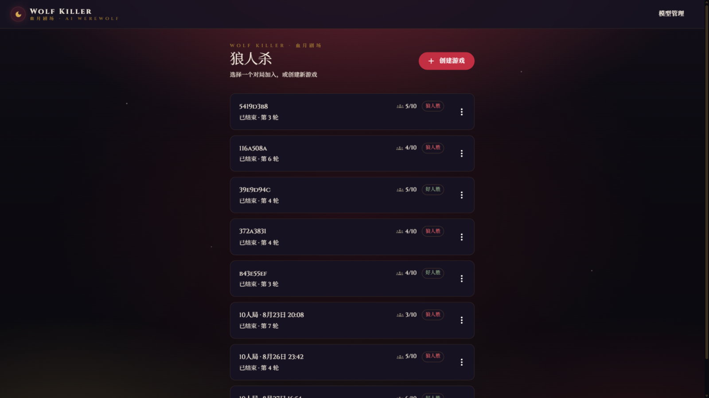
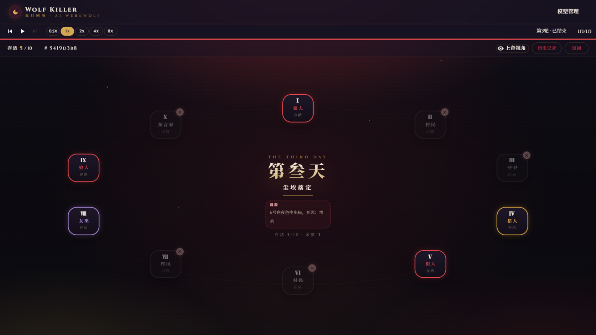

# Wolf Killer — AI 狼人杀

  

完全由 LLM 智能体驱动的狼人杀游戏。所有玩家（狼人、平民、预言家、女巫、猎人）均由大语言模型控制，无需真人参与。观众可通过基于时间轴的回放界面观看完整对局，创建游戏时可为整局配置 LLM（环境默认或自定义 API 配置）。

<p align="center">
  
  
</p>

## 特性

- **全 AI 对局**：狼人夜谈、白日发言、投票、遗言全部由 LLM 驱动，支持多模型随机分配
- **时间轴回放**：播放/暂停、逐帧步进、0.5x~8x 倍速、按事件类型筛选的观赛体验
- **通用角色流水线**：夜晚行动由冻结的角色声明 + 纯 Hook + 唯一原子写入口驱动，新增角色无需改动核心模块（守卫样例即验收证明）
- **工程化保障**：断点续跑检查点、存档版本化兼容校验、隐私边界扫描、statement/branch 100% 覆盖门禁

## 快速开始

环境要求：Python >= 3.11、Node.js >= 20.19（Vite 8 要求 `^20.19.0 || >=22.12.0`）、一个 OpenAI 兼容的 LLM API Key（如 [DeepSeek](https://platform.deepseek.com/)）。

**1. 配置后端环境变量**：在 `backend/` 下创建 `.env`（完整变量见 [docs/development.md](docs/development.md)）：

```ini
DEEPSEEK_API_KEY=sk-your-api-key
DEEPSEEK_BASE_URL=https://api.deepseek.com/v1
LLM_MODEL=deepseek-chat
LLM_TEMPERATURE=1.2
DEBUG=true
LOG_LEVEL=INFO
```

**2. 启动后端**：

```bash
cd backend
pip install -r requirements.txt
uvicorn app.main:app --host 127.0.0.1 --port 8000 --reload
```

**3. 启动前端**：

```bash
cd frontend
npm install
npm run dev
```

打开 `http://localhost:5173`，点击「创建游戏」，配置人数身份（默认 9 人局：3 狼人、3 平民、1 预言家、1 女巫、1 猎人）与整局模型，创建后自动开始。

## 使用指南

- **观看回放**：在大厅点击任意已结束的对局，用底部时间轴控制器播放、步进、调速（0.5x~8x）、拖拽进度；右侧历史面板可按事件类型筛选
- **进行中控制**：通过 WebSocket 对运行中的对局发送 `set_speed` / `pause` / `resume` / `skip_phase`
- **模型配置**：大厅的「模型管理」页面集中管理 API 配置（名称、base_url、model、Key 加密存储），支持连通性测试

## 文档

| 文档 | 内容 |
| --- | --- |
| [docs/gameplay.md](docs/gameplay.md) | 游戏规则、角色能力、对局流程、胜负条件 |
| [docs/architecture.md](docs/architecture.md) | 系统架构：模块划分、角色流水线、状态机、持久化 |
| [docs/development.md](docs/development.md) | 开发指南：环境变量全表、测试与门禁、数据存储、踩坑记录 |
| [docs/README.md](docs/README.md) | 文档索引（含历史设计稿归档） |

REST API 由 FastAPI 自动生成文档：启动后端后访问 `http://localhost:8000/docs`。

## 运行测试

```bash
cd backend && python -m pytest tests/ -q        # 后端 pytest（覆盖率门禁见 docs/development.md）
cd frontend && npm test                         # 前端 Vitest
```

## License

[MIT](LICENSE)
